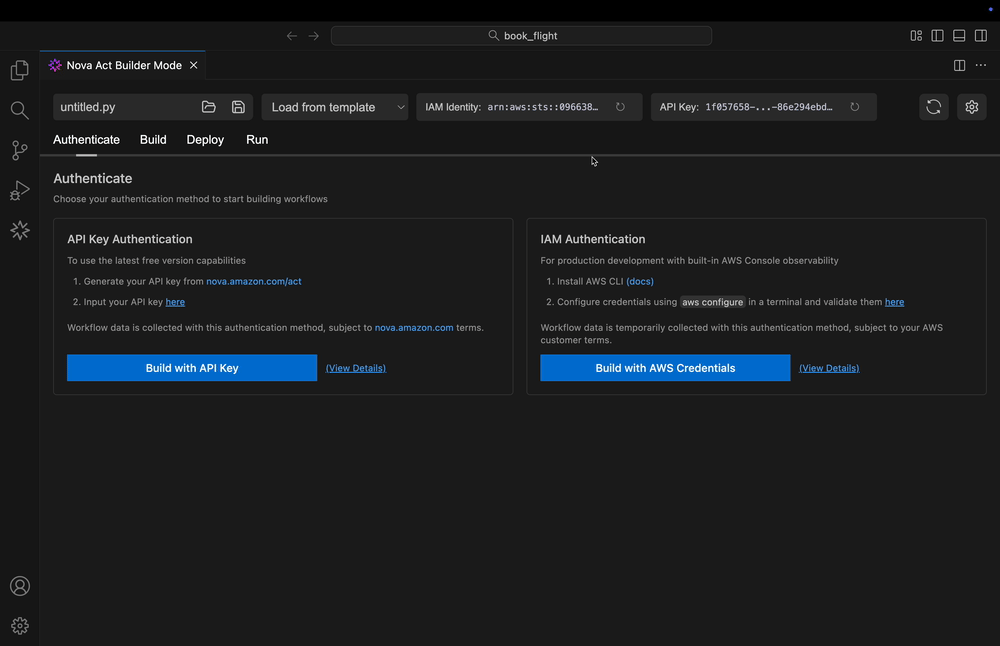
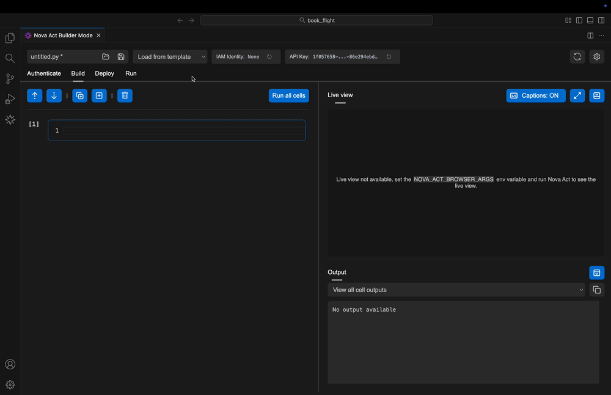
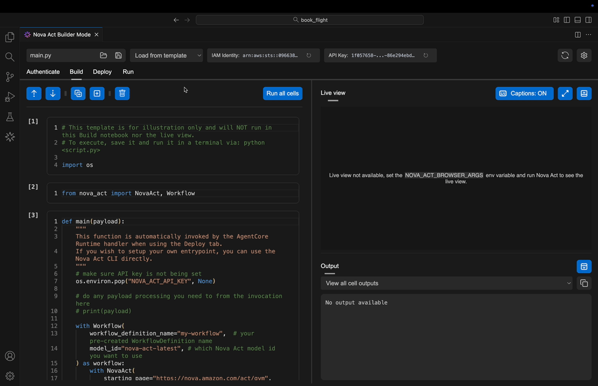
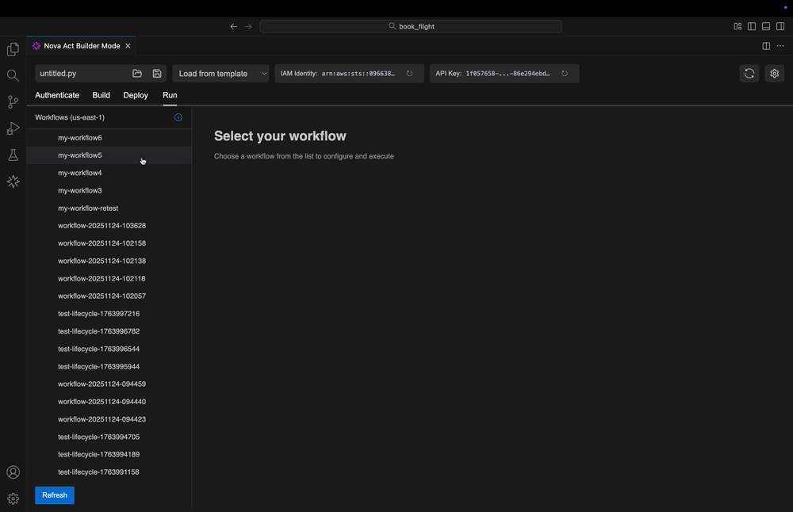

# Nova Act

Amazon Nova Act is available as an AWS service to build and manage fleets of reliable AI agents for automating production UI workflows at scale. Nova Act completes repetitive UI workflows in the browser and escalates to a human supervisor when appropriate. You can define workflows by combining the flexibility of natural language with Python code. Start by exploring in the web playground at nova.amazon.com/act, develop and debug in your IDE, deploy to AWS, and monitor your workflows in the AWS Console, all in just a few steps.

(Preview) Nova Act also integrates with external tools through API calls, remote MCP, or agentic frameworks, such as Strands Agents.

# Nova Act Extension: Build, Deploy, and Run AI Agents on AWS


The Nova Act extension provides a single unified experience for building AI agents with [Amazon Nova Act](https://nova.amazon.com/act). Build and test locally in your IDE, deploy to AWS with one click, and manage production workflows - all without leaving Visual Studio Code, Kiro, or Cursor.

## Table of Contents

- [Quick Start](#quick-start)
  - [Requirements](#requirements)
  - [Installation](#installation)
  - [Get API Key](#get-api-key)
  - [Your First Workflow](#your-first-workflow)
- [Authentication](#authentication)
  - [API Key Authentication](#api-key-authentication-free-version)
  - [AWS Credentials](#aws-credentials-aws-nova-act-service)
- [Build](#build)
  - [Step-by-Step Builder](#step-by-step-builder)
  - [Live Debugging](#live-debugging)
  - [Action Viewer](#action-viewer)
  - [Pre-Built Templates](#pre-built-templates)
- [Deploy](#deploy)
  - [Prerequisites](#prerequisites)
  - [Deployment Configuration](#deployment-configuration)
  - [Deploy Workflow](#deploy-workflow)
- [Run](#run)
  - [Workflow Selection](#workflow-selection)
  - [Configuring Workflow Inputs](#configuring-workflow-inputs)
  - [Invoke Workflows](#invoke-workflows)
- [Troubleshooting](#troubleshooting)
- [IDE Command Reference](#ide-command-reference)
- [Chat Command Reference](#chat-command-reference)
- [License](#license)
- [Data Collection](#data-collection)
- [Support](#support)

## Quick Start

### Requirements

- VS Code >= 1.94.0, Kiro, or Cursor
- Python 3.10+
- MacOS Sierra+, Ubuntu 22.04+, or Windows 10+
- 2GB free disk space (for Playwright browser dependencies)

### Installation

Install the extension and open the welcome page for an interactive walkthrough. You can also run `Nova Act: Start Walkthrough` from the Command Palette (`Cmd+Shift+P` / `Ctrl+Shift+P`) anytime.

The extension auto-detects Python 3.10+. If needed, manually configure your Python interpreter through your IDE's settings. See [Setting Python Interpreter](#setting-python-interpreter) for details.

### Get API Key

Get your API key from [nova.amazon.com/act](https://nova.amazon.com/act), then open the extension's [Authenticate](#authentication) tab and enter the API key. This enables local workflow development.

### Your First Workflow

**Create your first workflow:**

Open the [Build](#build) tab where you'll develop and test locally. You have a few options for with:

1. **Use a Template** - Start with pre-built examples → [Templates](#pre-built-templates)
2. **Chat-to-Script** - Describe your automation to @novaAct → [Chat Commands](#chat-command-reference)
3. **Write from Scratch** - Build in the notebook interface → [Step-by-Step Builder](#step-by-step-builder)

## Authentication

The extension supports two authentication options. Choose based on how you want to run your workflows:

<p align="center">
  
  <br/>
  <em>Authentication Tab</em>
</p>

### API Key Authentication (Free Version)

For local workflow development using the free version of Nova Act, get an API key from [nova.amazon.com/act](https://nova.amazon.com/act), then open the extension's **Authenticate** tab and enter it.

> _Note: When using the Nova Act Playground and/or choosing Nova Act developer tools with API key authentication, access and use are subject to the [nova.amazon.com](https://nova.amazon.com/act) Terms of Use._

### AWS Credentials (AWS Nova Act Service)

For running workflows against the AWS Nova Act service, you need AWS credentials with appropriate IAM permissions. AWS credentials are required for the **Deploy** and **Run** tabs.

Configure your AWS credentials using one of these methods:

- AWS CLI: Run `aws configure` to set up credentials
- Environment variables: Set `AWS_ACCESS_KEY_ID` and `AWS_SECRET_ACCESS_KEY`
- IAM roles: Use instance profiles or assumed roles

Verify your credentials are working:

```bash
aws sts get-caller-identity
```

Then press the refresh icon next to **IAM Identity** in the extension to validate your current AWS identity.

> _Note: When choosing developer tools with AWS IAM authentication and/or deploying workflows to the Nova Act AWS service, your AWS Service Terms and/or Customer Agreement (or other agreement governing your use of the AWS Service) apply._

## Build

The Build tab is where your workflow comes to life. This is your local development environment - a place to write, test, and refine your Nova Act workflow. The Build tab provides three interconnected capabilities that work together to accelerate your development:

1. **Chat-to-Script Generation** for creating an initial script
1. **Pre-Built Templates** for common use cases
1. **Step-by-Step Builder** for incremental development
1. **Live Debugging** for real-time insight
1. **Action Viewer** for post-execution analysis

### Chat-to-Script Generation: Start With a Conversation

Describe your automation needs in natural language to our @novaAct Copilot Chat participant, and get execution-ready agent scripts in minutes. Instead of starting from scratch with boilerplate code, simply tell the extension what you need.

<p align="center">
  
  <br/>
  <em>Chat-to-Script Generation</em>
</p>

See the [Chat Command Reference](#chat-command-reference) for available slash commands like `/shopping`, `/extract`, `/qa`, and more.

⚙️ Note: This feature requires GitHub Copilot and may not be availalble in some IDEs. To set it up, see [Copilot Quickstart](https://docs.github.com/en/copilot/get-started/quickstart?tool=vscode). To configure model access, see [Configuring access in GitHub Copilot](https://docs.github.com/en/copilot/how-tos/use-ai-models/configure-access-to-ai-models)

### Pre-Built Templates

Pre-Built Templates provide initial workflows you can load quickly and customize to your needs. After selecting a template, you'll work in the Build tab to develop and test locally.

<p align="center">
  
  <br/>
  <em>Pre-Built Templates</em>
</p>

The extension provides 7 templates to accelerate your workflow development. Templates are available in the Build tab's template selector.

| Template                        | Description                                                                                                                                                          |
| ------------------------------- | -------------------------------------------------------------------------------------------------------------------------------------------------------------------- |
| Starter Pack                    | Start your Nova Act journey with browser debugging at `nova.amazon.com/act/gym`. Includes API key configuration and basic setup-perfect for first-time users.        |
| QA Testing                      | Automate testing workflows with multi-step form validation and assertion patterns. Includes booking confirmation workflow with built-in verification.                |
| Data Extraction                 | Navigate pages and extract structured data using `nova.act_get()` with Pydantic schema integration. Ideal for web scraping tasks.                                    |
| Search and Extract              | Fill forms, search, and parse results across multiple pages. Handles navigation patterns and outputs structured data.                                                |
| Form Automation                 | Complete complex multi-step forms with field validation, error handling, and progress tracking through payment and confirmation flows.                               |
| AWS Workflow (Develop Local)    | Develop AWS workflows locally with workflow definition creation and S3 export configuration. Uses manual `__enter__`/`__exit__` pattern for extension compatibility. |
| AWS Workflow (Deployment Ready) | Production-ready workflow structure with proper credential handling (API key removal), workflow name validation, and S3 bucket configuration. Ready for Deploy tab.  |

### Step-by-Step Builder

The Step-by-Step Builder transforms your workflow development from a write-run-debug cycle into an interactive conversation with your code. Instead of writing an entire script and hoping it works, you build your workflow cell by cell-testing each piece as you go.

This notebook-style interface lets you execute individual cells independently. Made a small change to how your agent fills out a form? Run just that cell. Want to try a different approach to data extraction? Modify the cell and re-run it without touching the rest of your workflow. This modular approach means you can develop incrementally, adding cells, reordering them, and interleaving `act()` statements with regular Python code to build a robust agent one piece at a time.

<p align="center">
  
  <br/>
  <em>Step-by-Step Builder Mode</em>
</p>

Working with Browser Sessions: Each NovaAct session corresponds to a single browser session. When working interactively in a notebook, you can call `nova.act()` multiple times within the same session-the browser state persists between cells, which is exactly what you want for multi-step workflows.

If you need to start fresh with a clean browser session, you have two options:

1. Call `nova.stop()` followed by `nova.start()` in your code
2. Use the notebook's **Restart Notebook** button (top right) to tear down the current session and start clean

You rarely need to restart unless you want a brand-new browser session. In most workflows, you can call `nova.act()` multiple times without issue. The main exception is when you **Run All Cells**-this will attempt to create a second NovaAct instance, which isn't supported in the Nova Act extension. If that happens, click **Restart Notebook** to reset.

### Live Debugging

With Live Debugging, the browser and Nova Act's thinking/action logs appear side by side within your IDE. This unified experience means you can watch your workflow execute while simultaneously monitoring Nova Act's decision-making process.

The real power of Live Debugging is that it doesn't interrupt your flow. You can pause execution at any point to make adjustments, then resume testing without starting over. You can even multitask while the agent runs, editing code during execution and re-running cell by cell. This flexibility transforms debugging from a frustrating stop-start process into a smooth, iterative experience.

<p align="center">
  
  <br/>
  <em>Live Debugging Interface</em>
</p>

### Action Viewer

After your workflow completes, the Action Viewer helps you understand the full picture of what happened. Select "view your act run" for insights into a single `act()` statement, or "view your session" to analyze the entire end-to-end workflow.

<p align="center">
  
  <br/>
  <em>Action Viewer for Workflow Analysis</em>
</p>

The Action Viewer becomes especially valuable as you iterate. You can compare multiple runs side-by-side, easily spotting improvements or regressions without manually sifting through separate HTML files or log outputs. The Action Viewer makes these comparisons immediate and visual.

## Deploy

Once you've built and tested your workflow locally in the Build tab, the Deploy tab handles everything needed to run it on AWS. Deployment transforms your local Python script into a containerized, production-ready workflow that can execute remotely in the cloud. The Deploy tab uses the Nova Act CLI behind the scenes to orchestrate a multi-stage deployment process.

<p align="center">
  
  <br/>
  <em>Deploy Tab</em>
</p>

### Prerequisites

Before deploying workflows to AWS, set up your environment with the required tools and permissions:

| Component       | Purpose                                         | Verification                                       |
| --------------- | ----------------------------------------------- | -------------------------------------------------- |
| AWS Account     | Hosts deployed workflows                        | Active with billing enabled                        |
| IAM Permissions | Access to ECR, AgentCore Runtime, S3 (optional) | `aws sts get-caller-identity`                      |
| Nova Act CLI    | Orchestrates deployment                         | `act --version`                                    |
| Docker          | Builds container images                         | `docker --version`                                 |
| AWS Credentials | Authenticated access                            | Configure in [Authentication](#authentication) tab |

**IAM Permissions Explained:**

- **ECR (Elastic Container Registry)** - Stores your workflow's container images
- **AgentCore Runtime** - Executes your deployed workflows
- **S3 (optional)** - Stores workflow artifacts and exports if your workflow uses them

**Docker Installation:**

- macOS: [Docker Desktop](https://www.docker.com/products/docker-desktop)
- Linux: Docker Engine
- Windows: Docker Desktop with WSL2

Verify your setup before attempting deployment.

### Deployment Configuration

The Deploy tab guides you through providing the information needed for deployment:

| Field          | Required | Description                                                                                                                                                                                                                                                                                           |
| -------------- | -------- | ----------------------------------------------------------------------------------------------------------------------------------------------------------------------------------------------------------------------------------------------------------------------------------------------------- |
| Workflow Name  | Yes      | A name that identifies your workflow in AWS. Must use only lowercase letters, numbers, and hyphens; no spaces or special characters. Must match the workflow name defined in your source file using `@workflow` decorators or `with Workflow` context managers. Example: `customer-portal-automation` |
| Execution Role | No       | IAM role ARN that defines AWS permissions for your workflow. If blank, a default execution role with basic permissions is created. Provide a custom role when your workflow needs to access specific AWS services (S3, DynamoDB, etc.) or your organization requires specific IAM policies.           |
| Source File    | Yes      | Python file containing your workflow code. Must include a `def main(payload)` function as the entry point for AgentCore Runtime execution.                                                                                                                                                            |

### Deploy Workflow

When you click **Deploy Workflow**, the extension orchestrates five stages automatically:

1. **Workflow Creation** - The CLI creates a WorkflowDefinition in AWS with your specified name. This definition acts as a container for your workflow's metadata and configuration. If the WorkflowDefinition already exists, it uses that instead of creating one.
1. **Container Build** - Your Python script and its dependencies are packaged into a Docker container image that is compatible with AgentCore Runtime. This includes a default `agentcore_handler.py` file with boilerplate code that executes a `def main(payload)` function in your script. The `payload` is the AgentCore Runtime payload described [here](https://docs.aws.amazon.com/bedrock-agentcore/latest/APIReference/API_InvokeAgentRuntime.html#API_InvokeAgentRuntime_RequestBody).
1. **ECR Push** - The container image is pushed to Amazon ECR in your specified region. The CLI attempts to create a default ECR repository called `nova-act-cli-default` where all deployment images will be stored. This is why your local IAM role needs ECR permissions to create this repository. If your role cannot have these permissions, the CLI supports providing a custom `--ecr-repo`.
1. **Runtime Deployment** - The CLI creates an AgentCore Runtime instance configured with the container image for your workflow. It will be given the same name as the workflow name you specify. No environment variables will be configured on the instance by default, but you may pass `AC_HANDLER_ENV` dictionary in your payload and the default `agentcore_handler.py` will set those environment variables when invoked.
1. **Verification** - Once deployment completes, the extension provides a direct link to your workflow in the AWS Console where you can monitor executions and manage configuration.

The extension displays real-time progress for each stage in the **Deployment Output**. When deployment completes, you'll see a direct link to your workflow in the AWS Console and can click "Run Workflow" to invoke the workflow in the Run tab.

## Run

With your workflows deployed to AWS, the Run tab becomes your control center for execution and monitoring. This is where you move from development to running your workflows with different inputs, monitoring its progress, and reviewing execution logs.

<p align="center">
  
  <br/>
  <em>Run Tab</em>
</p>

### Workflow Selection

When you open the Run tab, the extension uses the Nova Act CLI to fetch workflow names and deployment status. If you have just deployed a workflow and do not see it in the list, click the **Refresh** button to update the list.

### Configuring Workflow Inputs

Workflows must define a `def main(payload)` function which will allow for passing an input AgentCore Runtime [payload](https://docs.aws.amazon.com/bedrock-agentcore/latest/APIReference/API_InvokeAgentRuntime.html#API_InvokeAgentRuntime_RequestBody) when invoking the workflow. The payload editor lets you provide these parameters as JSON. The exact parameters depend on how you defined your workflow. If your workflow needs `customer_id` and `action_type` parameters, construct a payload that has values for those keys and make sure your script parses it out of the `payload` variable.

### Invoke Workflows

After updating the payload, click **Invoke Your Workflow** to start a remote execution. The Run tab immediately begins streaming logs from AWS, showing you real-time progress as your workflow runs. You can click **View Your Workflow Run in AWS Console** to see the Nova Act Workflow Definition and historical run history.

## Troubleshooting

### "Please enable GitHub Copilot to use script generation" Error

If you see this error when clicking "Generate Workflows", ensure you have GitHub Copilot Chat installed and active:

1. **Install GitHub Copilot Chat**: Install the "GitHub Copilot Chat" extension from the VS Code marketplace
2. **Sign in**: Make sure you're signed in to your GitHub account with Copilot access
3. **Check Status**: Look for the Copilot icon in your VS Code status bar
4. **Restart VS Code**: Sometimes a restart is needed after installation

**Note**: The extension works with both "GitHub Copilot" and "GitHub Copilot Chat" extensions.

### Setting Python Interpreter

The Nova Act extension relies on the Nova Act SDK, which requires Python 3.10 or above. The extension will try to automatically detect a suitable Python interpreter. If a valid Python interpreter cannot be found, you can set it up manually:

**VS Code:** Follow [VS Code Python environment setup](https://code.visualstudio.com/docs/python/environments) to select your Python interpreter.

**Kiro / Cursor:** Follow the same procedure as VS Code to configure the Python interpreter.

**Verify Python Version**

You can check that your Python version is compatible by running:

```bash
python --version
```

or

```bash
python3 --version
```

Ensure the output shows Python 3.10 or above. If not, install or update Python before proceeding.

### UV Python Installation Issues

If you installed Python using `uv` (a fast Python package installer), you may encounter virtual environment creation errors during Nova Act setup.

**Symptoms:**

- Error message: `Command '[.../.nova-act-env/bin/python', '-m', 'ensurepip', ...]' returned non-zero exit status 1`
- Fresh installation fails during "Creating virtual environment" step

**Root Cause:**
UV-installed Python distributions are optimized for UV's workflow and may lack the `ensurepip` module required for standard Python virtual environment creation.

**Workaround:**

The Nova Act extension currently requires Python installed via Homebrew, system package managers, or python.org installers. UV-installed Python is not yet supported.

**Recommended Solutions:**

1. **Use Homebrew Python (macOS):**

   ```bash

   brew install python@3.12
   ```

   Then configure VS Code to use Homebrew Python by setting `python.defaultInterpreterPath` to `/opt/homebrew/bin/python3.12`

2. **Use system Python (macOS):**

   ```bash
   /usr/bin/python3 --version  # Verify version is 3.10+
   ```

   Configure VS Code to use system Python by setting `python.defaultInterpreterPath` to `/usr/bin/python3`

3. **Use python.org installer:**
   Download and install Python from [python.org](https://www.python.org/downloads/)

**If you must use UV Python:**

You can manually create a compatible virtual environment and install Nova Act:

```bash
# Remove any existing broken environment
rm -rf ~/.nova-act-env

# Create venv with UV using --seed flag (includes pip)
uv venv --seed ~/.nova-act-env --python 3.13

# Install Nova Act manually
~/.nova-act-env/bin/python -m pip install "nova_act[cli]>=3.0.5.0"

# Restart VS Code/Kiro to use the manually created environment
```

Note: This manual workaround may need to be repeated after extension updates.

### Authenticate

**API Key Authentication**

If your API key isn't working, the extension can't authenticate your local development sessions. This prevents you from using the Build tab or running workflows locally. To diagnose:

1. Verify your key is correct at [nova.amazon.com/act](https://nova.amazon.com/act)
1. Use `Nova Act: Set API Key` command to reset the stored key
1. Check extension logs for errors

**AWS Credentials**

AWS credential issues prevent deployment and remote execution. When credentials fail validation, you'll see errors in the Deploy or Run tabs. The extension needs valid AWS credentials with appropriate IAM permissions to interact with ECR, AgentCore Runtime, and S3.

To verify your credentials are working:

- Run `aws sts get-caller-identity` in your terminal
- Ensure AWS CLI is configured with `aws configure`
- Check that your IAM user or role has permissions for required services
- Verify credentials aren't expired (especially important for assumed roles)

If your IAM identity isn't showing in the Authenticate tab, click the refresh button to reload credentials

**Permission Errors**

Review the IAM permissions needed for ECR (container registry), AgentCore Runtime (workflow execution), and S3 (artifact storage). Contact your AWS administrator for permission grants, or check CloudTrail logs to identify which specific API calls are being denied.

### Build

**Browser Debugging**

When browser debugging doesn't work, you can't see what your agent is doing or interact with the Live Debugging interface. This usually indicates a port conflict or browser configuration issue.

Common causes and solutions:

- Port 9222 is already in use by another process - check with `lsof -i :9222` (macOS/Linux)
- Browser arguments are misconfigured - verify `NOVA_ACT_BROWSER_ARGS` environment variable
- Stale browser session - use the Restart Notebook button to reset
- Alternative debugging port needed - configure a different port in settings

**Port Conflicts**

If you see a **StartFailed** error when running `nova.start()`, there's likely a port conflict. Nova Act uses port 9222 for Chrome DevTools and port 8765 for internal communication (configurable). When these ports are occupied, Builder Mode fails to start.

Quick fix: Click the **Restart Notebook** button (top right in Builder Mode) to automatically clear port conflicts and reset extension state.

Manual fix for persistent conflicts:

macOS / Linux:

```bash
lsof -i :9222
lsof -i :8765
kill -9 <PID>
```

Windows (PowerShell):

```bash
netstat -ano | findstr :9222
netstat -ano | findstr :8765
taskkill /PID <PID> /F
```

### Deploy

**Common Deployment Issues**

| Issue                 | Cause                                     | Solution                                                                                                            |
| --------------------- | ----------------------------------------- | ------------------------------------------------------------------------------------------------------------------- |
| CLI not found         | Nova Act CLI not installed or not in PATH | Install with `pip install nova-act[cli]` and ensure it's in PATH or configure `novaAct.cliPath` in VS Code settings |
| Docker not available  | Docker isn't running or isn't accessible  | Start Docker Desktop (macOS/Windows) or Docker daemon (Linux), then try deploying again                             |
| Invalid workflow name | Workflow name contains invalid characters | Use only lowercase letters, numbers, and hyphens. No spaces, underscores, or special characters                     |
| Permission denied     | AWS credentials lack required permissions | Verify IAM permissions for ECR, AgentCore, and S3. Check CloudTrail logs for specific permission failures           |

**CLI Not Found**

When the extension can't find the Nova Act CLI, deployment fails immediately. The CLI orchestrates the entire deployment process, so it must be installed and accessible.

Diagnostic steps:

- Verify installation with `act --version`
- Check that PATH includes the CLI location with `echo $PATH`
- Set a custom path in VS Code settings using `novaAct.cliPath`
- Reinstall the CLI with `pip install --upgrade nova-act[cli]`

**Docker Availability**

Docker builds the container image for your workflow. If Docker isn't running or accessible, the deployment process fails during the image build stage.

To fix:

- Start Docker Desktop (macOS/Windows) or run `orb start`
- Verify Docker is running with `docker ps`
- Check Docker daemon status on Linux with `systemctl status docker`
- Ensure Docker is in your PATH

**ECR Push Failures**

ECR (Elastic Container Registry) stores your workflow's container image. Push failures prevent deployment from completing. Common causes include authentication issues, missing repositories, or insufficient disk space.

To resolve:

- Authenticate Docker to ECR: `aws ecr get-login-password | docker login --username AWS --password-stdin <account>.dkr.ecr.<region>.amazonaws.com`
- Verify the ECR repository exists and is accessible
- Check available disk space for image builds

**Workflow Naming**

Invalid workflow names cause deployment to fail during workflow creation. Workflow names must follow the following naming conventions:

- Use only lowercase letters, numbers, and hyphens
- No spaces or special characters
- Must start with a letter

### Run

**Payload Format**

Payload format errors prevent workflow execution from starting. The payload must be valid JSON that matches your workflow's expected parameters.

To fix payload errors:

- Ensure payload is valid JSON syntax
- Use the Format button to validate and pretty-print

**Execution Timeout**

Workflows have a 24-hour timeout by default. If your workflow times out:

- Check workflow logic for infinite loops or blocking operations
- Monitor CloudWatch logs for detailed error messages
- Consider breaking long workflows into smaller, composable steps

**Log Streaming**

Log streaming issues prevent you from monitoring workflow execution in real-time. Logs buffer up to 10MB per workflow to prevent memory issues.

If log streaming stops:

- Switch to another workflow and back to refresh the stream
- Check network connectivity to AWS
- Restart the extension if logs don't resume

## IDE Command Reference

Nova Act provides several commands accessible through the VS Code Command Palette (`Cmd/Ctrl + Shift + P`). Type "Nova Act" to see all available commands.

| Command                                        | Description                                                                                                    |
| ---------------------------------------------- | -------------------------------------------------------------------------------------------------------------- |
| **Nova Act: Start Walkthrough**                | Opens the interactive walkthrough guide covering authentication, building workflows, deployment, and execution |
| **Nova Act: Menu**                             | Opens the main Nova Act menu with quick access to all extension features and documentation                     |
| **Nova Act: Set API Key**                      | Prompts you to enter or update your Nova Act API key for authentication (required for local development)       |
| **Nova Act: Builder Mode**                     | Opens the main Builder Mode interface for developing and testing workflows locally with live browser debugging |
| **Nova Act: Authenticate**                     | Opens the Authenticate tab to configure your API key and AWS credentials                                       |
| **Nova Act: Deploy Workflow**                  | Opens the Deploy tab to containerize and deploy your workflow to AWS AgentCore Runtime                         |
| **Nova Act: Run Workflows**                    | Opens the Run tab to execute deployed workflows and monitor their execution in real-time                       |
| **Nova Act: View Step Details**                | Displays detailed information about a specific workflow step, including parameters and execution context       |
| **Nova Act: View Workflow Documentation**      | Opens the documentation for the currently active workflow, including usage examples and API reference          |
| **Nova Act: Open Action Viewer**               | Opens the Action Viewer to browse available Nova Act actions and their documentation                           |
| **Nova Act: Update or Install Nova Act Wheel** | Updates or installs the Nova Act Python package to the latest version                                          |
| **Nova Act: Get Nova Act Version**             | Displays the currently installed version of the Nova Act Python package and extension                          |

## Chat Command Reference

Nova Act integrates with VS Code's chat interface through the `@novaAct` participant. Use these slash commands in the chat panel to generate specific types of workflows.

| Command                 | Description                                      |
| ----------------------- | ------------------------------------------------ |
| `@novaAct /learn`       | Learn how to use Nova Act for browser automation |
| `@novaAct /shopping`    | Generate shopping automation workflows           |
| `@novaAct /extract`     | Extract data from web pages                      |
| `@novaAct /search`      | Search and navigate web content                  |
| `@novaAct /qa`          | Generate QA test automation scripts              |
| `@novaAct /formfilling` | Automate form filling workflows                  |
| `@novaAct /workflow`    | Create AWS Workflows for deployment              |

## License

This project is distributed under the [Apache License, Version 2.0](https://www.apache.org/licenses/LICENSE-2.0)

## Data Collection

The Nova Act extension uses the telemetry settings you've configured in VS Code, Kiro, and Cursor. If enabled, we will collect aggregate telemetry data to help us improve the extension and provide a better experience. You can opt out anytime by managing your settings in [VS Code](https://code.visualstudio.com/docs/supporting/FAQ#_how-to-disable-telemetry-reporting), [Kiro](https://kiro.dev/docs/privacy-and-security/data-protection/), or Cursor.

## Support

- 🐛 [File a bug](https://github.com/aws/nova-act-extension/issues/new?assignees=&labels=bug&projects=&template=bug_report.md)
- 🚀 [Submit a Feature Request](https://github.com/aws/nova-act-extension/issues/new?assignees=&labels=feature-request&projects=&template=feature_request.md)
- 💬 [Discussions](https://github.com/aws/nova-act-extension/discussions)
- 📖 [Documentation](https://github.com/aws/nova-act-extension#readme)

---

**Enjoy automating with [Nova Act](https://nova.amazon.com/act)!** 🚀
