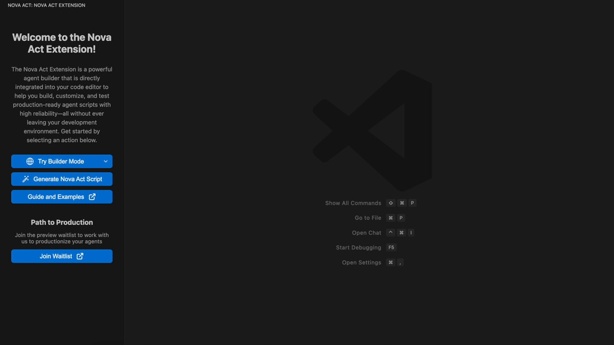

# Nova Act Extension: Build and Test AI Agents Without Leaving Your IDE


The Nova Act extension transforms how you build with [Amazon Nova Act](https://github.com/aws/nova-act) by bringing the entire agent development experience directly into IDEs like Visual Studio Code, Kiro, and Cursor. No more switching between tools or losing your train of thought—unify agent development, testing, and debugging into a single IDE environment designed for building reliable AI agents.

[Learn more about Amazon Nova Act.](https://nova.amazon.com/act)

> Our extension uses your VS Code telemetry settings. If it is enabled, we collect only anonymous, aggregate telemetry data to help us improve the extension and provide a better experience. If you prefer, you can opt out at any time by following the [instructions](https://code.visualstudio.com/docs/supporting/FAQ#_how-to-disable-telemetry-reporting) for VS Code, or the equivalent settings in Kiro and Cursor.

<p align="center">
  
  <br/>
  <em>Nova Act extension demo</em>
</p>

## Table of Contents

- [Key Features](#key-features)
  - [Chat-to-Script Generation](#chat-to-script-generation-start-with-a-conversation)
  - [Step-by-Step Builder](#step-by-step-builder-build-and-test-cell-by-cell)
  - [Live Debugging](#live-debugging-watch-your-agent-think-and-act)
  - [Action Viewer](#action-viewer-review-and-compare-workflow-versions)
- [Requirements](#requirements)
- [Getting Started](#getting-started)
- [IDE Commands](#ide-commands)
- [Chat Commands](#chat-commands)
- [Setting Python Interpreter](#setting-python-interpreter)
- [Troubleshooting](#troubleshooting)
- [License](#license)
- [Support](#support)

## Key Features

### Chat-to-Script Generation: Start With a Conversation

Describe your automation needs in natural language and get execution-ready agent scripts in minutes. Instead of starting from scratch with boilerplate code, simply tell the extension what you need.

For instance: "I need an agent that logs into a customer portal, searches for unresolved tickets, and updates their status based on completion criteria." The extension generates a functional script that handles authentication flow, navigation, search functionality, and status updates—giving you a solid foundation to build on.

<p align="center">
  
  <br/>
  <em>Chat-to-Script Generation</em>
</p>

### Step-by-Step Builder: Build and Test Cell by Cell

Execute your script cell-by-cell with our notebook-style builder. Make a small change without running the entire script again. Focus on specific parts of your workflow—testing different approaches, tweaking parameters, and validating results in real-time.

This modular approach means you can develop incrementally, adding cells, reordering them, and interleaving `act()` statements with regular Python code to build a robust agent one piece at a time.

<p align="center">
  
  <br/>
  <em>Step-by-Step Builder Mode</em>
</p>

### Live Debugging: Watch Your Agent Think and Act

Bring your code, browser view, and thinking and action logs into a single, cohesive experience within your IDE. Watch your agent execute while simultaneously monitoring its decision-making process—seeing exactly what it sees, why it makes each choice, and where things might go wrong.

Pause execution at any point to make adjustments, then resume testing without starting over. You can even multitask while the agent runs, editing code during execution and re-running cell by cell.

<p align="center">
  
  <br/>
  <em>Live Debugging Interface</em>
</p>

### Action Viewer: Review and Compare Workflow Versions

After your agent completes a run, examine everything that happened at whatever level of detail you need. Select "view your act run" for insights into a single act() statement or "view your session" to analyze the entire end-to-end workflow.

Compare multiple runs side-by-side as you iterate on your scripts. Easily spot improvements or regressions without manually sifting through separate HTML files or log outputs.

<p align="center">
  
  <br/>
  <em>Action Viewer for Workflow Analysis</em>
</p>

## Requirements

- IDE
  - VS Code >= 1.94.0
  - Latest version of Kiro
  - Latest version of Cursor
- Python version >= 3.10
- Operating System: MacOS Sierra+, Ubuntu 22.04+ or Windows 10+
- Sufficient disk space: installing Playwright and its browser dependencies can be large. We recommend at least 2GB of total free disk space for smooth setup

## Getting Started

After installation, open the extension to view the welcome page with an interactive walkthrough. You can also access it anytime by running `Nova Act: Start Walkthrough` from the Command Palette (`Cmd+Shift+P` / `Ctrl+Shift+P`).

## IDE Commands

The following commands are available in the IDE Command Palette (`Cmd+Shift+P` / `Ctrl+Shift+P`).

| Command                                      | Description                                      |
| -------------------------------------------- | ------------------------------------------------ |
| `Nova Act: Start Walkthrough`                | Launch the interactive walkthrough               |
| `Nova Act: Set API Key`                      | Configure your Nova Act API key                  |
| `Nova Act: Builder Mode`                     | Open the visual workflow builder                 |
| `Nova Act: Open Action Viewer`               | Open custom result viewer for automation outputs |
| `Nova Act: Menu`                             | Open Nova Act extension menu                     |
| `Nova Act: View Nova Act Details`            | Open `NovaAct` class documentation               |
| `Nova Act: Update or Install Nova Act Wheel` | Download or update the latest Nova Act wheel     |
| `Nova Act: Get Nova Act Version`             | Get the version of the installed Nova Act wheel  |

## Chat Commands

Use `@novaAct` in the IDE chat with these specialized commands:

- `/learn` - Learn how to use Nova Act for browser automation
  - Sample: `@novaAct /learn Teach me about Nova Act`
- `/shopping` - Generate shopping automation workflows
  - Sample: `@novaAct /shopping Find the best deals on wireless headphones`
- `/extract` - Extract data from web pages
  - Sample: `@novaAct /extract Get the product names and prices from https://example.com search results`
- `/search` - Search and navigate web content
  - Sample: `@novaAct /search Look up tutorials on Playwright testing`
- `/qa` - Generate QA test automation scripts
  - Sample: `@novaAct /qa Create a login test for the demo site https://example.com`
- `/formfilling` - Automate form filling workflows
  - Sample: `@novaAct /formfilling Fill out the signup form on https://example.com/register with test user data`

## Setting Python Interpreter

The Nova Act extension relies on the [Nova Act SDK](https://github.com/aws/nova-act), which requires Python 3.10 or above. The extension will try to automatically detect a suitable Python interpreter.
If a valid Python interpreter cannot be found, you can set it up manually:

VS Code: Follow [VS Code Python environment setup](https://code.visualstudio.com/docs/python/environments) to select your Python interpreter.

Kiro / Cursor: Follow the same procedure as VS Code to configure the Python interpreter.

### Verify Python Version

You can also check that your Python version is compatible by running:

`python --version` or `python3 --version`

Ensure the output shows Python 3.10 or above. If not, install or update Python before proceeding.

## Troubleshooting

### Port Usage

If you get a **StartFailed** error when running `nova.start()`, most likely there's a port conflict or you already have a running Nova Act client.

The Nova Act extension uses local ports `9222` (for Chrome DevTools) and `8001` (for internal communication). If these ports are already in use, Builder Mode may fail to start correctly.

#### Quick Fix

The **Restart Notebook** button (top right in Builder Mode) should clear port conflicts automatically and reset your extension state. If this fix does not work for you, proceed with the steps below:

#### macOS / Linux

```bash
lsof -i :9222
lsof -i :8001
kill -9 <PID>
```

#### Windows (PowerShell)

```bash
netstat -ano | findstr :9222
netstat -ano | findstr :8001
taskkill /PID <PID> /F
```

## License

This project is distributed under the [Apache License, Version 2.0](https://www.apache.org/licenses/LICENSE-2.0)

## Support

- 🐛 [File a bug](https://github.com/aws/nova-act-extension/issues/new?assignees=&labels=bug&projects=&template=bug_report.md)
- 🚀 [Submit a Feature Request](https://github.com/aws/nova-act-extension/issues/new?assignees=&labels=feature-request&projects=&template=feature_request.md)
- 💬 [Discussions](https://github.com/aws/nova-act-extension/discussions)
- 📖 [Documentation](https://github.com/aws/nova-act-extension#readme)

---

**Enjoy automating with [Nova Act](https://nova.amazon.com/act)!** 🚀
