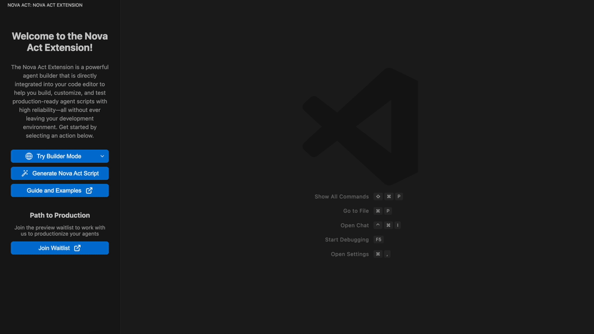

# Generate a Nova Act script

Use the Amazon Nova Act code participant to generate an Amazon Nova Act script directly from your chat with Copilot.

Open your Copilot Chat and enter `@novaAct <your prompt>` or `@novaAct /learn` to get more info on Amazon Nova Act capabilities.

Note that this feature requires GitHub Copilot. Visit the [Copilot Quickstart page](https://docs.github.com/en/copilot/get-started/quickstart?tool=vscode) for help setting it up.

